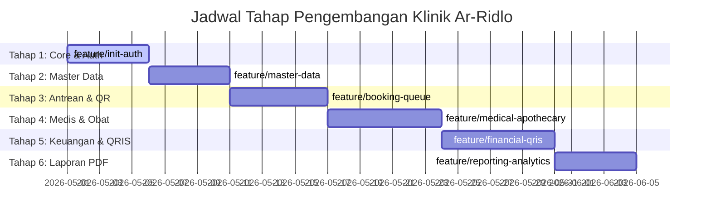

# Peta Jalan Pengembangan (Development Roadmap)

## Sistem Informasi Klinik Ar-Ridlo (Laravel 12 + Filament v4 + MySQL 8.0+)

Dokumen ini memetakan tahapan pengembangan sistem informasi klinik secara runut menggunakan alur kerja berbasis cabang Git (**Git Branching Strategy**). Roadmap ini disesuaikan untuk menggunakan pendekatan **Hibrida (Filament untuk Admin + Custom Blade untuk Pasien)** pada framework **Laravel 12** + **Filament v4** dan **MySQL 8.0+**.

> [!NOTE]
> **Catatan Versi**: Tech stack akhir yang diputuskan adalah **Laravel 12 + Filament v4** (bukan Laravel 13) karena Filament v4 belum kompatibel penuh dengan Laravel 13. Laravel 12 (rilis Februari 2025) adalah versi terbaru yang stabil dan _production-ready_ dengan dukungan Filament v4 penuh.

---

---

### 📌 Tahap 1: Inisialisasi Proyek & Sistem Autentikasi ✅

- **Nama Cabang Git (Branch)**: `feature/init-auth`
- **Checklist Aktivitas**:
    - [x]   1. Menginisialisasi proyek **Laravel 12** menggunakan Composer.
    - [x]   2. Melakukan instalasi dan konfigurasi **Filament PHP v4** panel admin (`/admin`).
    - [x]   3. Mengonfigurasi kredensial koneksi database **MySQL 8.0+** pada berkas `.env`.
    - [x]   4. Membuat migrasi database dasar (tabel `users` + kolom `role` & `no_hp`) dan seeder `AdminSeeder`.
    - [x]   5. Membangun sistem registrasi (pasien), login, dan logout menggunakan **Laravel Breeze** (Blade + Tailwind CSS + Alpine.js).
    - [x]   6. Membuat custom middleware `IsAdmin` dan `IsPasien` untuk mengamankan hak akses route.
    - [x]   7. Menyiapkan halaman dashboard pasien awal (`pasien/dashboard.blade.php`) dengan **Tailwind CSS** dan redirect login berbasis role.

- **Fitur Utama**:
    - Pendaftaran akun pasien baru secara mandiri (via Breeze).
    - Form Login pasien dengan redirect otomatis berdasarkan role (`admin` → `/admin`, `pasien` → `/pasien/dashboard`).
    - Proteksi halaman admin (via `FilamentUser::canAccessPanel`) dan dashboard pasien (via middleware `is.pasien`).
- **Tabel Database**:
    - `users`

---

### 📌 Tahap 2: Pengelolaan Data Master (Filament Resources) ✅

- **Nama Cabang Git (Branch)**: `feature/master-data`
- **Checklist Aktivitas**:
    - [x]   1. Membuat **Filament Resource** untuk kelola data Pasien (`PasienResource`).
    - [x]   2. Menambahkan logika generate Nomor Rekam Medis unik otomatis (_RM-YYYYMMDD-XXXX_) saat data pasien baru dibuat di Filament.
    - [x]   3. Membuat **Filament Resource** untuk kelola data Dokter (`DokterResource`).
    - [x]   4. Membuat **Filament Resource** untuk kelola data Pegawai (`PegawaiResource`).
    - [x]   5. Membuat **Filament Resource** untuk kelola Jadwal Praktek Dokter (`JadwalDokterResource`) (hari, jam mulai/selesai, serta kuota pasien per hari).
    - [x]   6. Menambahkan seeder data tiruan (dummy) untuk mempercepat pengujian.

- **Fitur Utama**:
    - CRUD Kelola Akun & Pasien di Filament.
    - CRUD Kelola Dokter & Pegawai di Filament.
    - CRUD Kelola Jadwal Praktek Dokter di Filament.
- **Tabel Database**:
    - `pasiens`
    - `dokters`
    - `pegawais`
    - `jadwal_dokters`

---

### 📌 Tahap 3: Pemesanan Antrean & Generator QR Code ✅

- **Nama Cabang Git (Branch)**: `feature/booking-queue`
- **Checklist Aktivitas**:
    - [x]   1. Membangun sistem booking nomor urut antrean harian secara otomatis (sisi Pasien - Custom Blade).
    - [x]   2. Mengintegrasikan package QR Code generator pada Laravel untuk merender data antrean menjadi gambar QR Code dinamis (sisi Pasien - Custom Blade).
    - [x]   3. Membuat antarmuka pemantauan antrean real-time untuk admin di Filament.
    - [x]   4. Membangun fitur pemanggilan antrean (panggil, lewatkan, selesaikan antrean) menggunakan Filament Custom Page / Custom Actions.

- **Fitur Utama**:
    - **Pemesanan Antrean (Pasien)**: Pasien memilih tanggal kunjungan dan dokter di Custom Blade, sistem mengalokasikan nomor urut berikutnya secara otomatis.
    - **QR Code Antrean**: Pasien mendapatkan tanda bukti antrean digital berupa QR Code unik (`kode_antrean`) yang dapat diunduh di Custom Blade.
    - **Panel Kontrol Antrean (Admin)**: Admin dapat memanggil antrean yang aktif, memperbarui status antrean (`Menunggu` âž” `Dipanggil` âž” `Selesai`/`Batal`) di Filament.
- **Tabel Database**:
    - `antreans`

---

### 📌 Tahap 4: Pelayanan Medis & Manajemen Apotek (Filament & Custom Blade)

- **Nama Cabang Git (Branch)**: `feature/medical-apothecary`
- **Checklist Aktivitas**:
    - [x]   1. Membuat form input diagnosa rekam medis dan peracikan resep obat di Filament (`PemeriksaanResource` & `ResepResource`).
    - [x]   2. Membuat **Filament Resource** untuk kelola inventaris obat (`ObatResource`).
    - [x]   3. Mengimplementasikan logika pengurangan stok obat otomatis di Laravel Model/Observer saat resep obat disimpan di Filament.
    - [x]   4. Menambahkan widget notifikasi stok kritis (< 10) dan deteksi kadaluarsa obat pada dashboard admin Filament.
    - [x]   5. Menghubungkan riwayat rekam medis & resep agar bisa dibaca oleh pasien yang bersangkutan di portal Custom Blade.

- **Fitur Utama**:
    - **Input Rekam Medis & Resep (Admin)**: Mencatat diagnosa, keluhan, tindakan, biaya konsultasi, serta meracik obat beserta aturan pakai di Filament.
    - **Riwayat Medis Pasien (Pasien)**: Menampilkan kartu riwayat pengobatan masa lalu serta detail resep obat di Custom Blade.
    - **CRUD Inventaris Obat (Admin)** di Filament.
- **Tabel Database**:
    - `pemeriksaans`
    - `obats`
    - `reseps`
    - `resep_details`

---

### 📌 Tahap 5: Keuangan, Integrasi QRIS Midtrans & Penggajian (Filament & Custom Blade)

- **Nama Cabang Git (Branch)**: `feature/financial-qris`
- **Checklist Aktivitas**:
    - [ ]   1. Mengintegrasikan **Midtrans Snap SDK** ke dalam form pembayaran pasien di portal Custom Blade.
    - [ ]   2. Membangun antarmuka input nominal pembayaran manual oleh pasien di portal Custom Blade.
    - [ ]   3. Membuat route penampung Midtrans Webhook Notification untuk memproses pelunasan otomatis.
    - [ ]   4. Membangun halaman **Simulator Pembayaran Sukses (Offline)** di menu admin Filament untuk kelancaran demo sidang ujian.
    - [ ]   5. Membuat **Filament Resource** untuk pengelolaan gaji dokter & pegawai (`GajiResource`).
    - [ ]   6. Membuat slip gaji format PDF yang bisa dicetak untuk pegawai & dokter.

- **Fitur Utama**:
    - **Pembayaran QRIS Mandiri (Pasien)**: Pasien mengetik nominal âž” Sistem memanggil QRIS Midtrans âž” Pembayaran divalidasi otomatis di Custom Blade.
    - **Modul Penggajian (Admin)**: Perhitungan gaji bulanan dokter & pegawai beserta fitur cetak Slip Gaji format PDF di Filament.
    - **Monitoring Transaksi (Admin)**: Daftar rekonsiliasi seluruh invoice masuk (pembayaran dari pasien) dan pengeluaran umum klinik di Filament.
- **Tabel Database**:
    - `transaksis`
    - `pengeluarans`
    - `gajis`

---

### 📌 Tahap 6: Laporan Ekspor PDF & Visualisasi Dashboard

- **Nama Cabang Git (Branch)**: `feature/reporting-analytics`
- **Checklist Aktivitas**:
    - [ ]   1. Mengintegrasikan package PDF (`Barryvdh-Dompdf`) dengan templat desain Kop Surat Resmi Klinik Ar-Ridlo.
    - [ ]   2. Membuat filter laporan keuangan dan kunjungan berdasarkan rentang tanggal di Filament.
    - [ ]   3. Menyisipkan grafik interaktif **Chart.js / Filament Widgets** di dashboard admin untuk analisis visual statistik operasional klinik.
    - [ ]   4. Membuat visualisasi diagram donat untuk peringkat "Obat Paling Laris" menggunakan Filament Widget Chart.

- **Fitur Utama**:
    - **Dashboard Analitik (Admin)**: Visualisasi tren pemasukan bulanan, diagram donat obat terlaris, dan rasio pasien harian di Filament.
    - **Laporan PDF Siap Cetak (Admin)**:
        1. Laporan Pemasukan & Pengeluaran Kas.
        2. Laporan Aktivitas Kunjungan Konsultasi Pasien.
        3. Laporan Mutasi & Nilai Stok Obat.
- **Tabel Database**:
    - _Tidak ada tabel baru (tahap ini melakukan ekstraksi data/reporting dari seluruh tabel sebelumnya)._

---

### 📌 Tahap 7: UI/UX Redesign & Finalisasi Frontend (Landing Page, Auth, Portal)

- **Nama Cabang Git (Branch)**: `feature/uiux-frontend`
- **Checklist Aktivitas**:
    - [ ]   1. Menerapkan desain premium (tema Hijau Sage & Oranye) pada Landing Page utama.
    - [ ]   2. Merombak halaman Login & Register (Breeze) menjadi tampilan modern sesuai identitas klinik.
    - [ ]   3. Memoles UI/UX portal dashboard pasien agar lebih responsif, elegan, dan _user-friendly_.
    - [ ]   4. Menambahkan animasi mikro (_micro-animations_) dan efek transisi (_hover states_) pada elemen interaktif.
    - [ ]   5. Memastikan semua antarmuka (termasuk Filament panel) rapi secara estetika sebelum _deployment_ final.

- **Fitur Utama**:
    - **Kesan Pertama (_First Impression_)**: Desain visual premium untuk memukau pengguna dan dosen penguji.
    - **Konsistensi Desain**: Semua halaman (_public_, _patient portal_, _admin_) menggunakan satu bahasa desain yang sama.
- **Tabel Database**:
    - _Hanya pembaruan visual, tidak ada perubahan struktur database._
