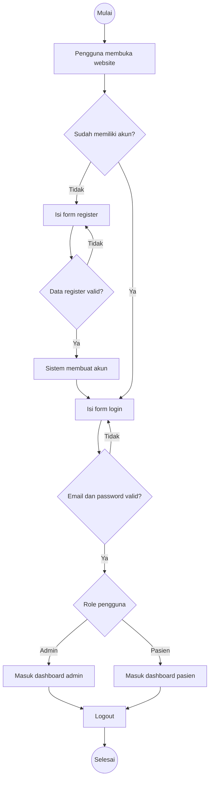
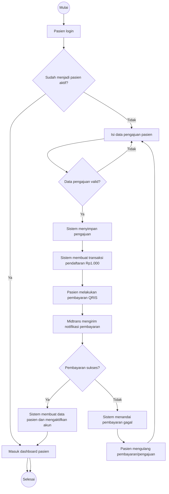
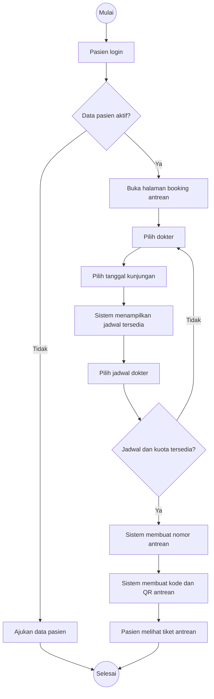
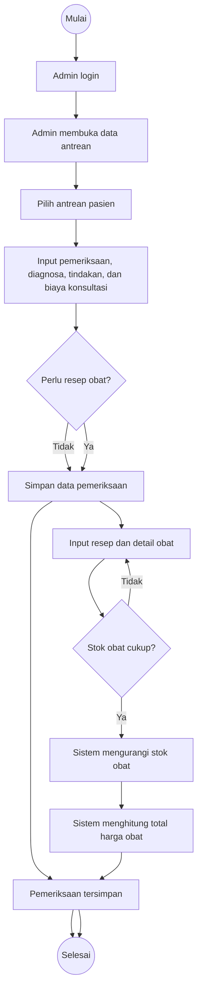
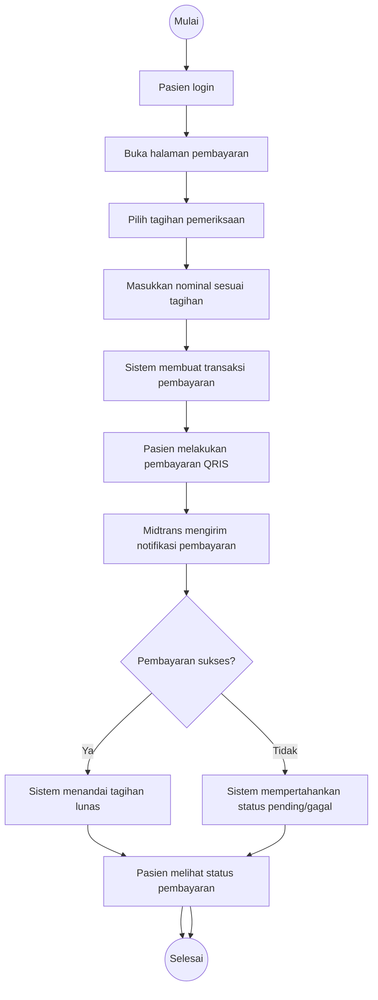
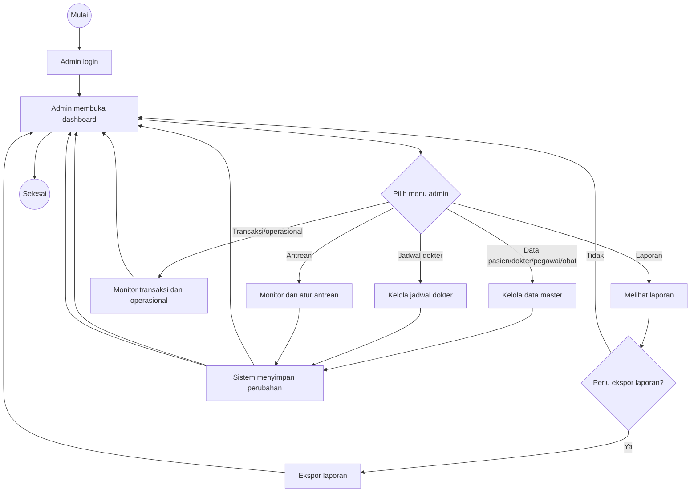

# Activity Diagram - Sistem Informasi Klinik Ar-Ridlo

Activity diagram dibuat berdasarkan kelompok proses utama agar tetap mudah dibaca dalam laporan.

## 1. Activity Diagram Autentikasi Pengguna

## 2. Activity Diagram Pengajuan dan Aktivasi Pasien

## 3. Activity Diagram Booking Antrean

## 4. Activity Diagram Pemeriksaan dan Resep

## 5. Activity Diagram Pembayaran Konsultasi

## 6. Activity Diagram Administrasi dan Laporan

