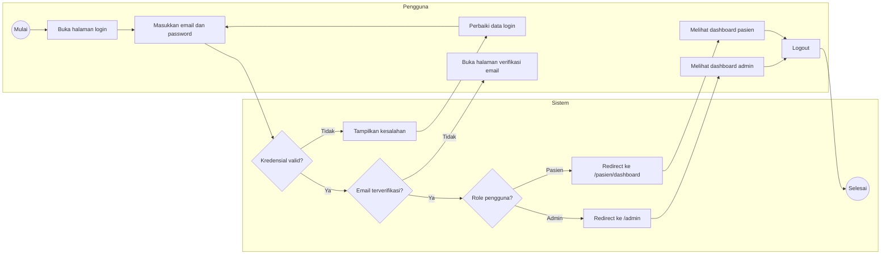
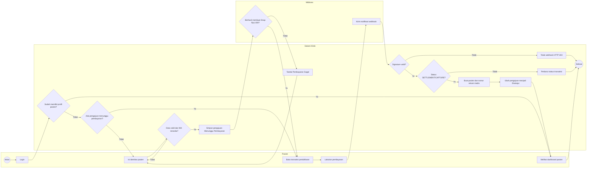
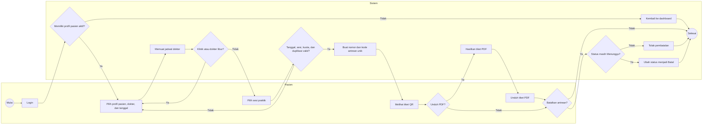
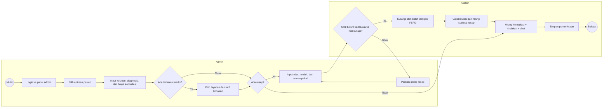
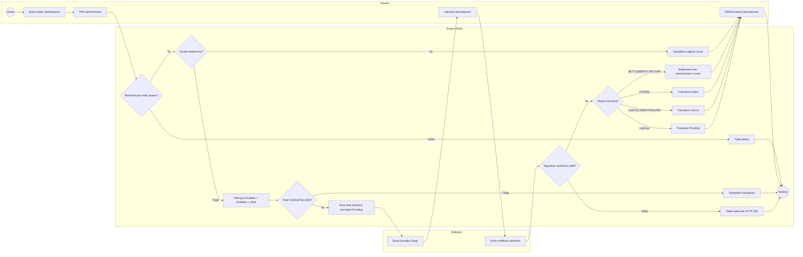
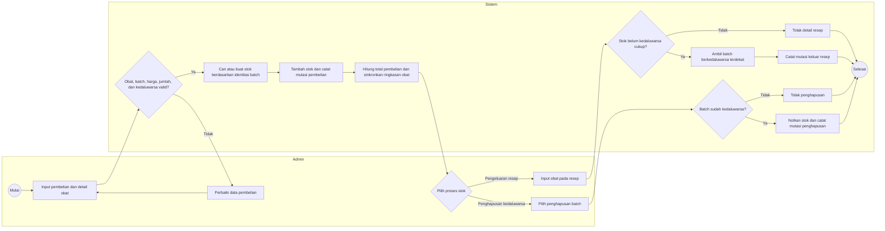
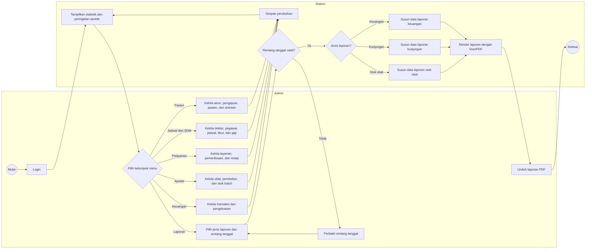

# Activity Diagram - Sistem Informasi Klinik Ar-Ridlo

Activity diagram berikut menggunakan **swimlane** untuk memisahkan aktivitas berdasarkan pelakunya. Pada Mermaid, setiap sekat dibuat menggunakan `subgraph`, sedangkan perpindahan proses antar-sekat ditunjukkan oleh panah yang menghubungkan node pada subgraph berbeda.

## 1. Autentikasi dan Pengalihan Berdasarkan Role

## 2. Pengajuan dan Aktivasi Pasien

## 3. Booking dan Pembatalan Antrean

## 4. Pemeriksaan, Tindakan, dan Resep

## 5. Pembayaran Tagihan Pemeriksaan

## 6. Pembelian dan Pergerakan Stok Obat

## 7. Administrasi dan Laporan

## Catatan Tampilan Mermaid

- `subgraph` berfungsi sebagai sekat atau swimlane.
- `flowchart LR` menempatkan lane dari kiri ke kanan, sedangkan `direction TB` mengarahkan aktivitas di dalam setiap lane dari atas ke bawah.
- Posisi akhir dapat sedikit berbeda antar-renderer Mermaid karena layout dihitung otomatis.
- Untuk hasil skripsi yang benar-benar presisi seperti diagram UML pada contoh, hasil Mermaid dapat diekspor ke SVG lalu dirapikan di draw.io tanpa mengubah alurnya.
