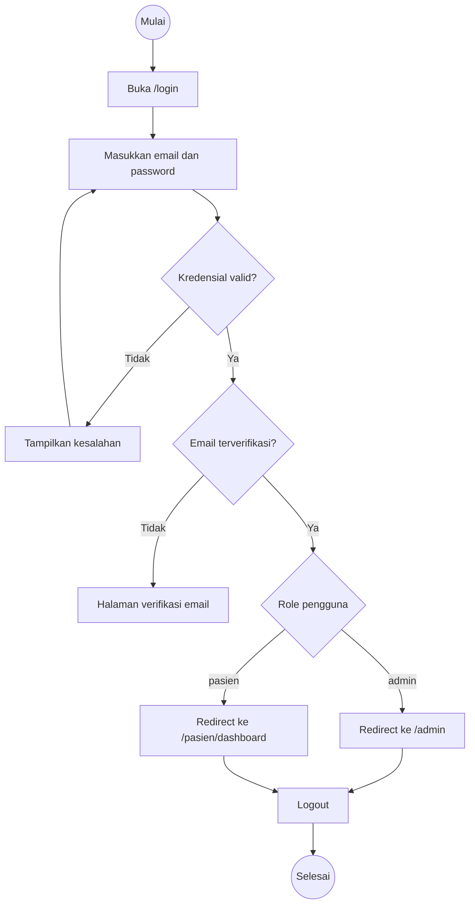
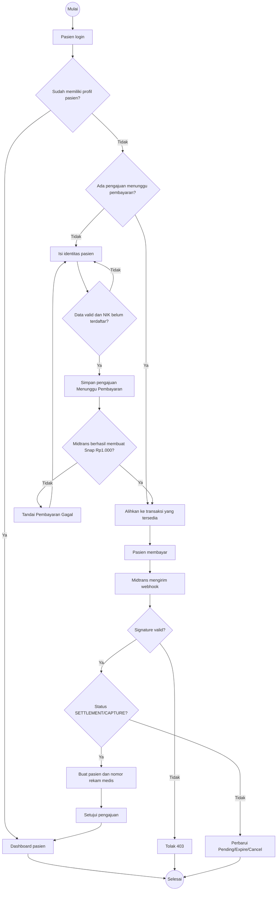
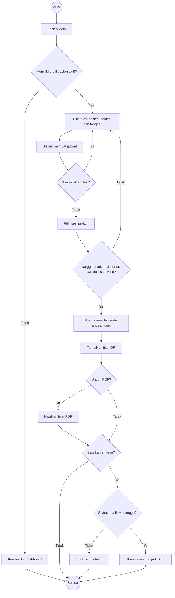
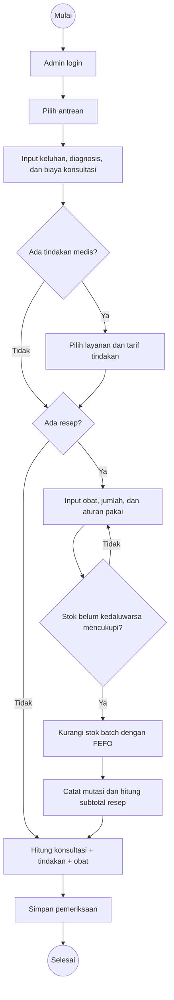
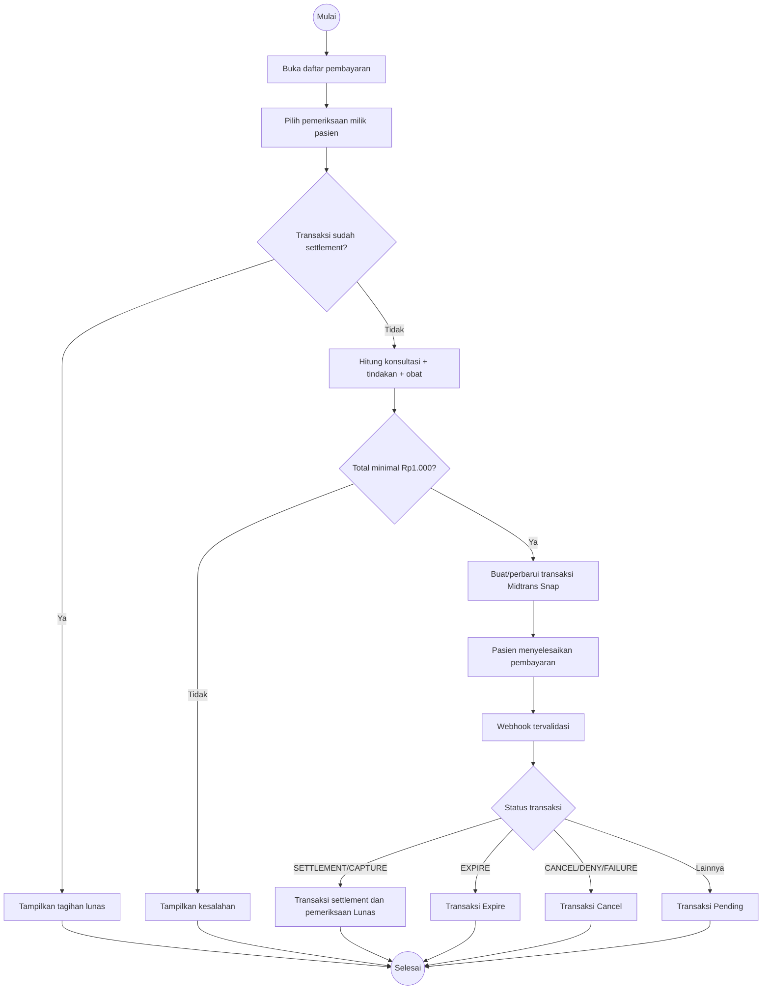
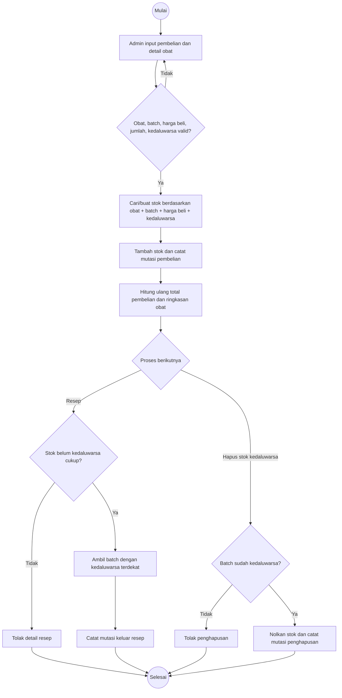
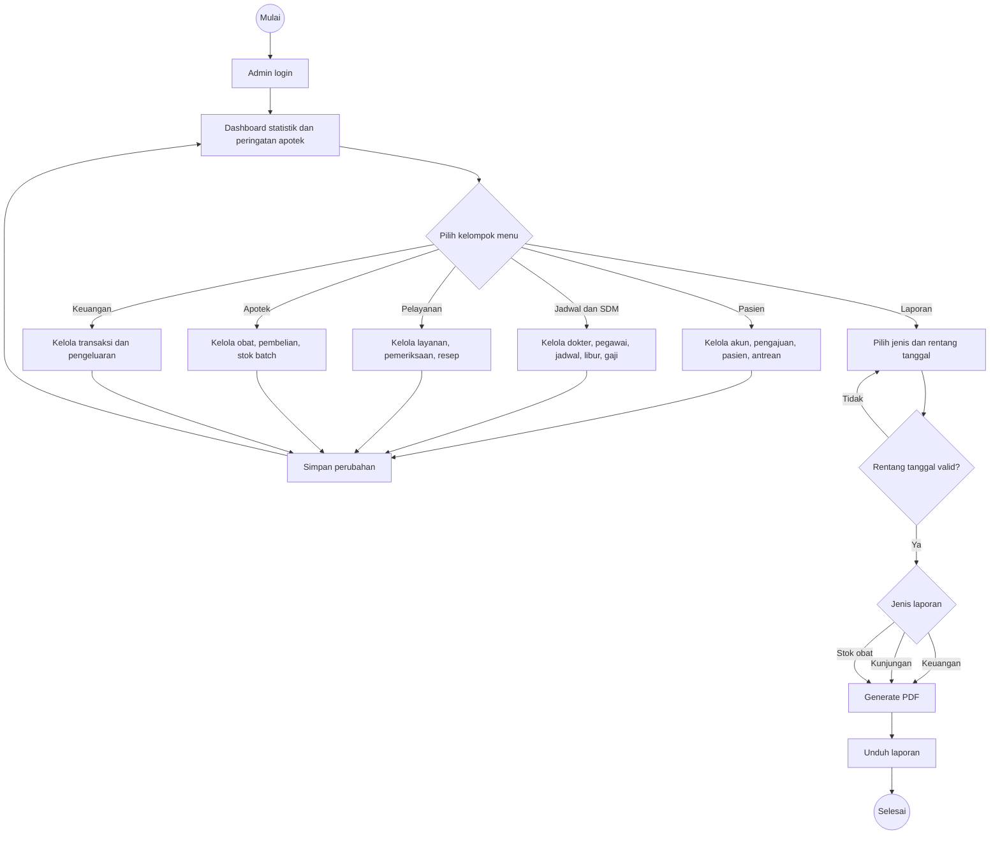

# Activity Diagram - Sistem Informasi Klinik Ar-Ridlo

Activity diagram berikut menggambarkan tujuh proses utama sesuai implementasi aktual.

## 1. Autentikasi dan Pengalihan Berdasarkan Role

## 2. Pengajuan dan Aktivasi Pasien

## 3. Booking dan Pembatalan Antrean

## 4. Pemeriksaan, Tindakan, dan Resep

## 5. Pembayaran Tagihan Pemeriksaan

## 6. Pembelian dan Pergerakan Stok Obat

## 7. Administrasi dan Laporan

