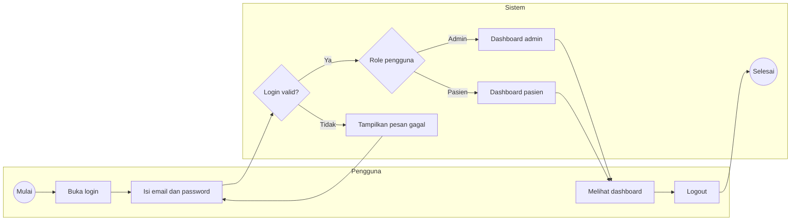
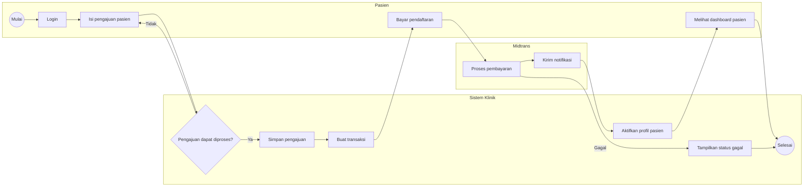
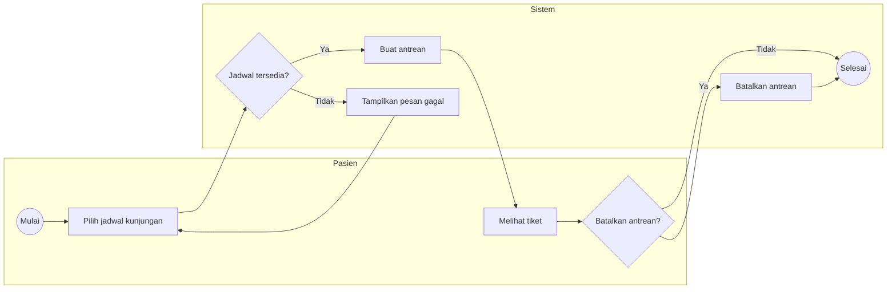
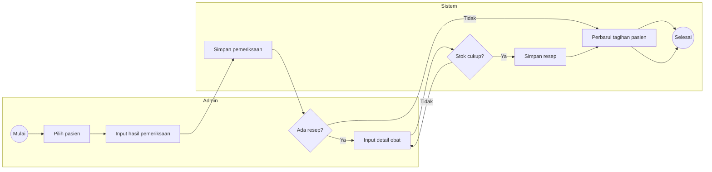
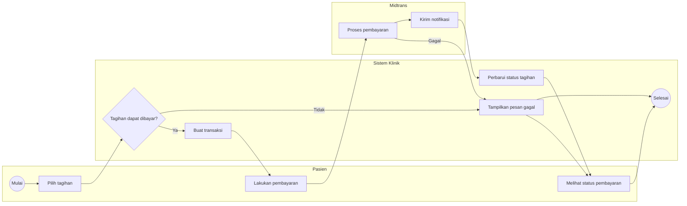
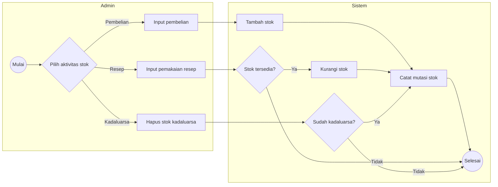
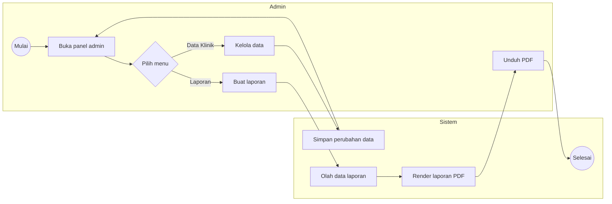

# Activity Diagram - Sistem Informasi Klinik Ar-Ridlo

Activity diagram berikut dibuat dalam bentuk ringkas agar mudah ditempatkan pada laporan skripsi. Seluruh diagram hanya menampilkan alur utama dan keputusan penting, sedangkan detail teknis seperti validasi field, status webhook, dan proses internal service dijelaskan pada sequence diagram.

## 1. Autentikasi dan Pengalihan Berdasarkan Role

## 2. Pengajuan dan Aktivasi Pasien

## 3. Booking dan Pembatalan Antrean

## 4. Pemeriksaan, Tindakan, dan Resep

## 5. Pembayaran Tagihan Pemeriksaan

## 6. Pembelian dan Pergerakan Stok Obat

## 7. Administrasi dan Laporan

## Catatan Tampilan Mermaid

- Activity diagram dibuat ringkas agar tetap terbaca ketika dimasukkan ke laporan.
- Detail teknis sistem tetap dijelaskan pada sequence diagram.
- Jika diagram masih terlalu lebar, orientasi Mermaid dapat diubah dari `flowchart LR` menjadi `flowchart TB` sebelum diekspor.
