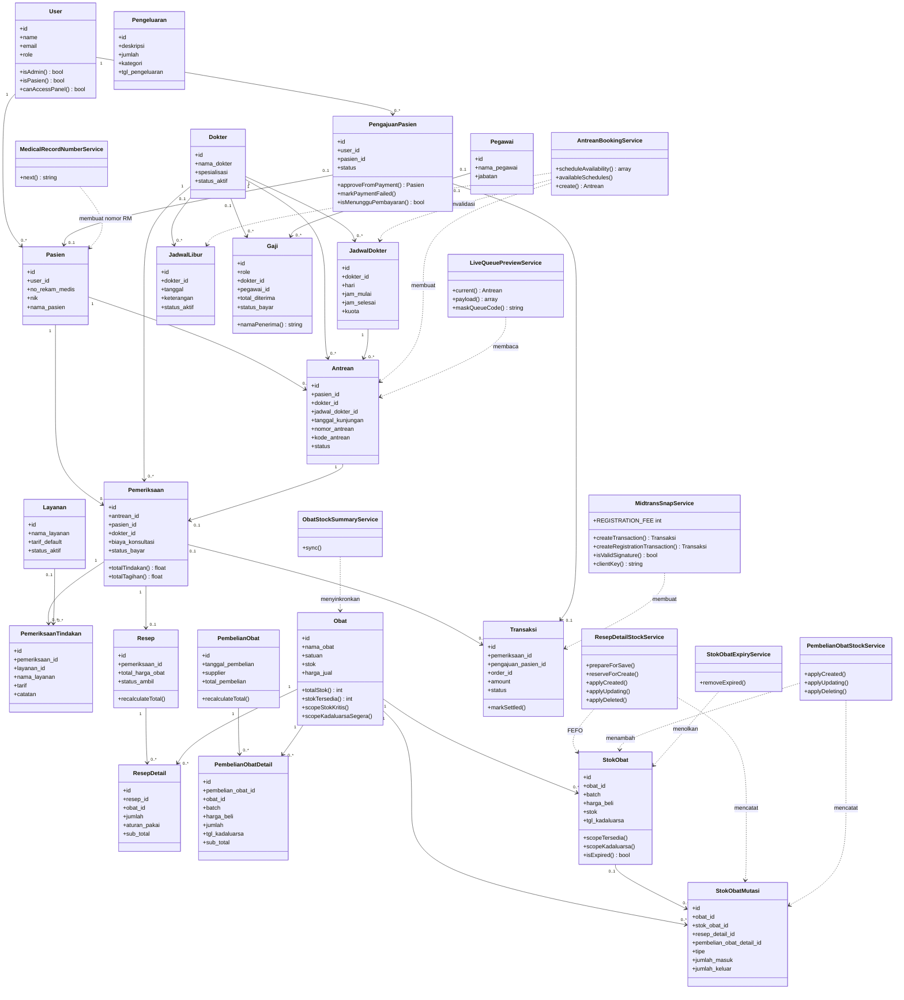

# Class Diagram - Sistem Informasi Klinik Ar-Ridlo

Diagram memuat model domain dan service yang menjalankan aturan bisnis utama. Controller, request, middleware, resource Filament, widget, dan view tidak ditampilkan.

## Tanggung Jawab Lapisan

| Lapisan | Tanggung jawab |
|---|---|
| Model | Struktur data, relasi Eloquent, cast, agregasi domain, dan event model. |
| Service | Transaksi bisnis yang melibatkan validasi, locking, integrasi eksternal, atau beberapa model. |
| Controller/Request | Otorisasi kepemilikan, validasi input HTTP, orkestrasi service, dan response. |
| Filament Resource | Antarmuka CRUD dan aksi operasional admin. |
| View | Presentasi portal pasien, panel admin, tiket, slip, dan laporan. |

## Aturan Bisnis yang Diwakili

- `Pemeriksaan::totalTagihan()` menjumlahkan konsultasi, seluruh tindakan, dan total resep.
- `Transaksi::markSettled()` melunasi pemeriksaan atau memicu aktivasi pengajuan pasien.
- `ResepDetailStockService` mengeluarkan stok belum kedaluwarsa dengan urutan FEFO dan mencatat mutasi per batch.
- `PembelianObatStockService` menambah stok berdasarkan identitas batch sekaligus menghitung ulang total pembelian.
- `ObatStockSummaryService` menjaga kolom ringkasan pada `obats` tetap sesuai dengan detail `stok_obats`.
