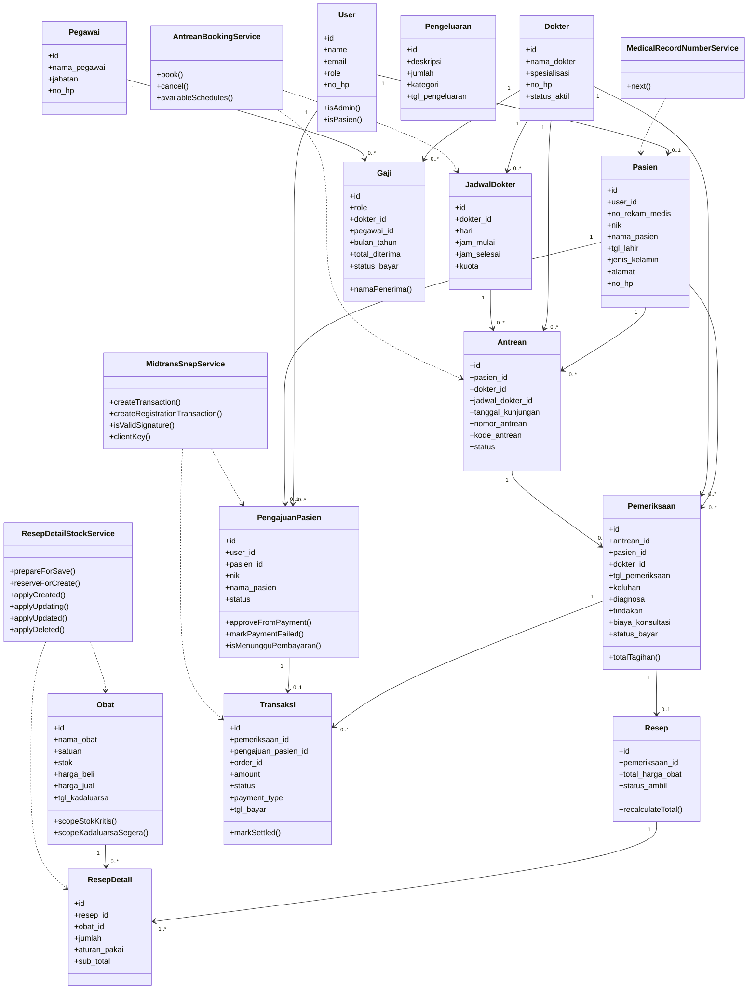

# Class Diagram - Sistem Informasi Klinik Ar-Ridlo

Class diagram ini menampilkan model domain utama dan service penting yang menjalankan proses bisnis. Class teknis Laravel seperti controller, middleware, migration, request, dan Filament resource tidak ditampilkan agar diagram tetap ringkas untuk laporan.

## Catatan

| Bagian | Keterangan |
|---|---|
| Model | Merepresentasikan entitas utama klinik dan relasi antar data. |
| Service | Merepresentasikan proses bisnis penting yang dipisah dari controller dan model. |
| Controller dan Filament Resource | Tidak ditampilkan karena berperan sebagai lapisan antarmuka/aplikasi, bukan domain inti. |
