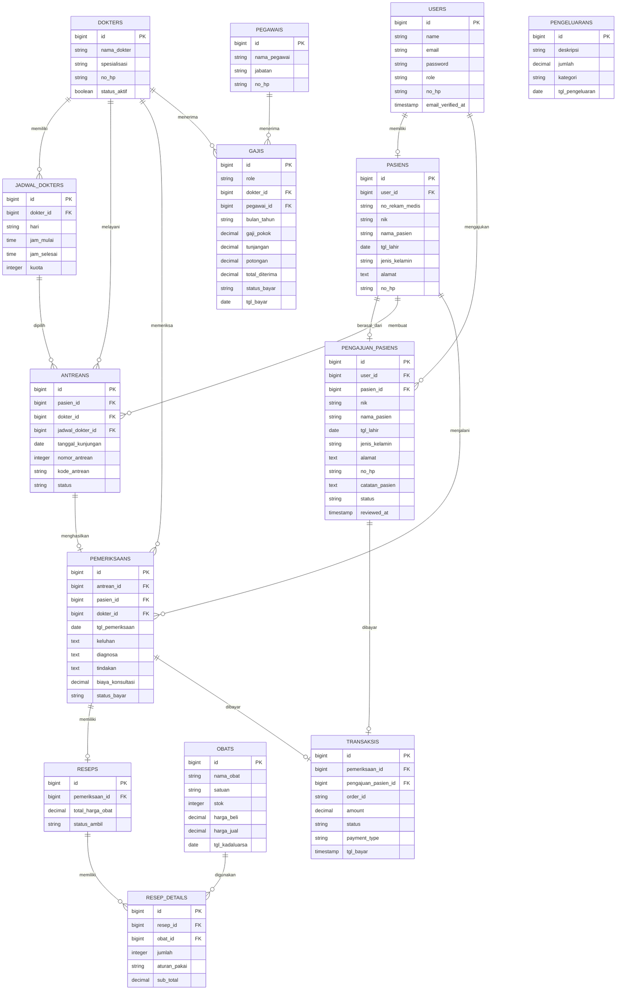

# ERD - Sistem Informasi Klinik Ar-Ridlo

ERD ini menampilkan tabel domain utama yang digunakan sistem. Tabel teknis bawaan Laravel seperti `sessions`, `cache`, `jobs`, `failed_jobs`, dan `migrations` tidak ditampilkan agar diagram tetap fokus pada proses bisnis klinik.

## Catatan

| Bagian | Keterangan |
|---|---|
| `users` dan `pasiens` | Satu akun pasien dapat memiliki satu data pasien setelah aktivasi berhasil. |
| `pengajuan_pasiens` | Menyimpan data pengajuan pasien sebelum menjadi data pasien aktif. |
| `transaksis` | Dapat terkait ke `pemeriksaans` untuk pembayaran konsultasi atau ke `pengajuan_pasiens` untuk pembayaran pendaftaran. |
| `resep_details` dan `obats` | Detail resep mengurangi stok obat dan membentuk total harga obat. |
| `gajis` | Penerima gaji dapat berupa dokter atau pegawai sesuai nilai `role`. |
