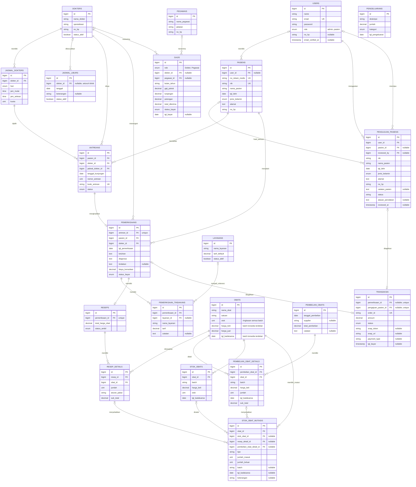

# ERD - Sistem Informasi Klinik Ar-Ridlo

ERD berikut merepresentasikan seluruh tabel domain pada migration saat ini. Kolom `created_at` dan `updated_at` tidak ditulis agar diagram tetap terbaca.

## Aturan Integritas Penting

| Aturan | Implementasi |
|---|---|
| Nomor rekam medis, NIK pasien, kode antrean, dan `order_id` | Unik. |
| Nomor antrean | Unik per dokter, tanggal kunjungan, dan nomor antrean. |
| Pemeriksaan | Maksimal satu untuk setiap antrean. |
| Resep | Maksimal satu untuk setiap pemeriksaan. |
| Transaksi | Maksimal satu per pemeriksaan atau satu per pengajuan pasien. Salah satu relasi digunakan sesuai jenis tagihan. |
| Identitas stok | Unik berdasarkan obat, batch, harga beli, dan tanggal kedaluwarsa. |
| Jadwal libur | `dokter_id = NULL` berarti libur seluruh klinik; nilai dokter tertentu berarti libur dokter tersebut. |
| Tindakan pemeriksaan | Menyimpan salinan nama layanan dan tarif agar histori tidak berubah saat master layanan diperbarui/dihapus. |
| Stok pada `obats` | Ringkasan kompatibilitas; sumber detail persediaan adalah `stok_obats` dan auditnya `stok_obat_mutasis`. |

## Catatan Kardinalitas

Codebase menggunakan relasi `User::pasiens()` sehingga satu akun dapat terhubung ke beberapa profil pasien. Walaupun tersedia pula helper `User::pasien()`, alur portal pasien mengambil koleksi `pasiens` dan memvalidasi kepemilikan berdasarkan seluruh ID profil tersebut.
