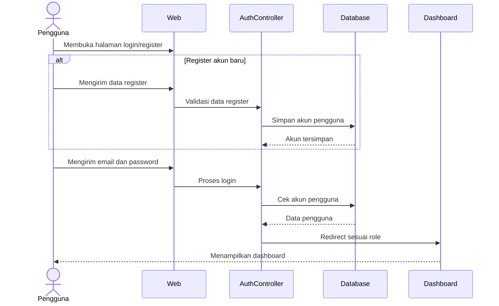
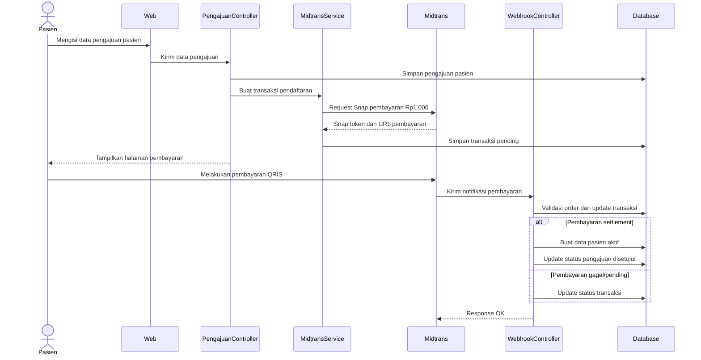
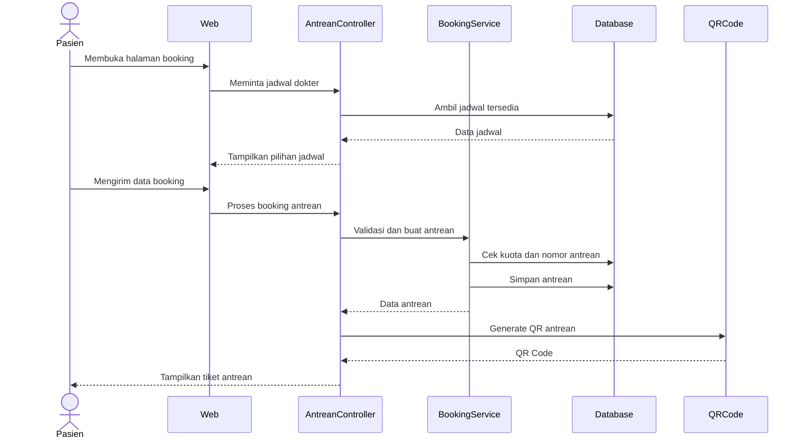
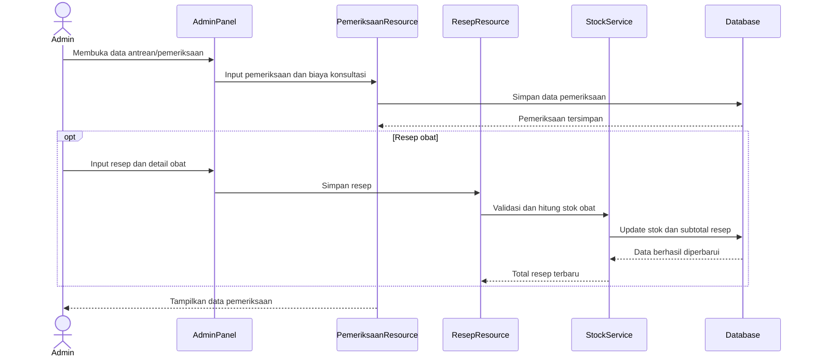
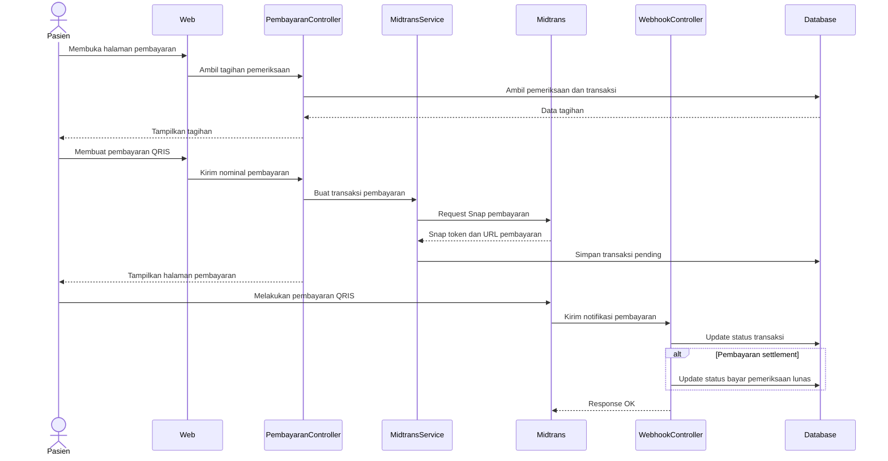
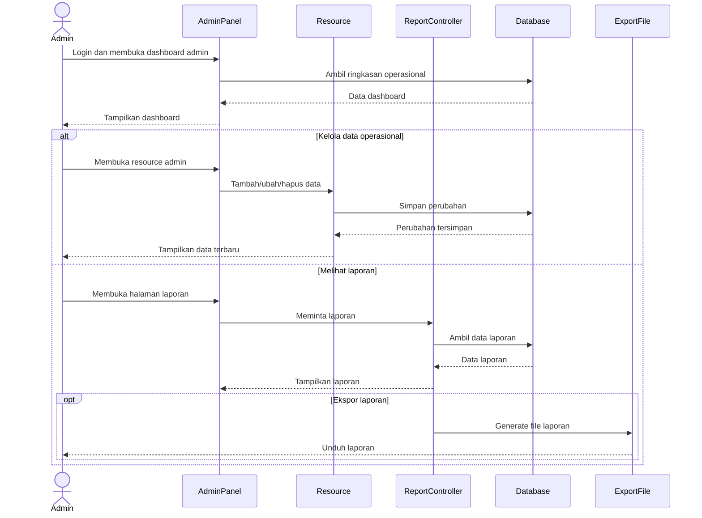

# Sequence Diagram - Sistem Informasi Klinik Ar-Ridlo

Sequence diagram dibuat mengikuti activity diagram utama. Komponen ditampilkan pada level besar agar diagram tetap ringkas untuk laporan.

## 1. Sequence Diagram Autentikasi Pengguna

## 2. Sequence Diagram Pengajuan dan Aktivasi Pasien

## 3. Sequence Diagram Booking Antrean

## 4. Sequence Diagram Pemeriksaan dan Resep

## 5. Sequence Diagram Pembayaran Konsultasi

## 6. Sequence Diagram Administrasi dan Laporan

