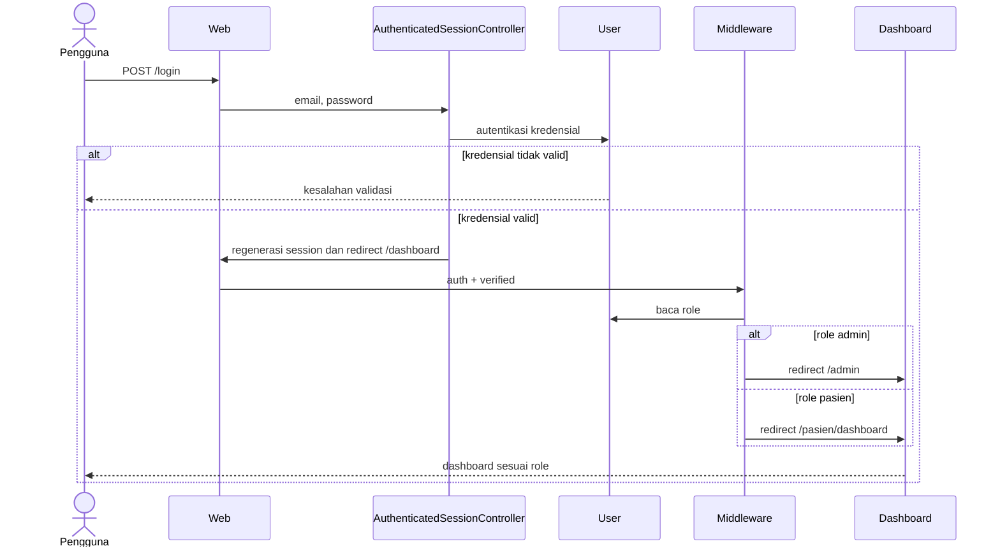
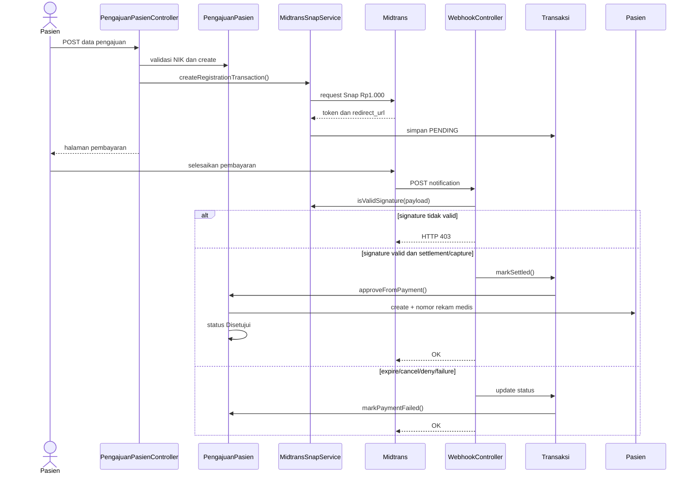
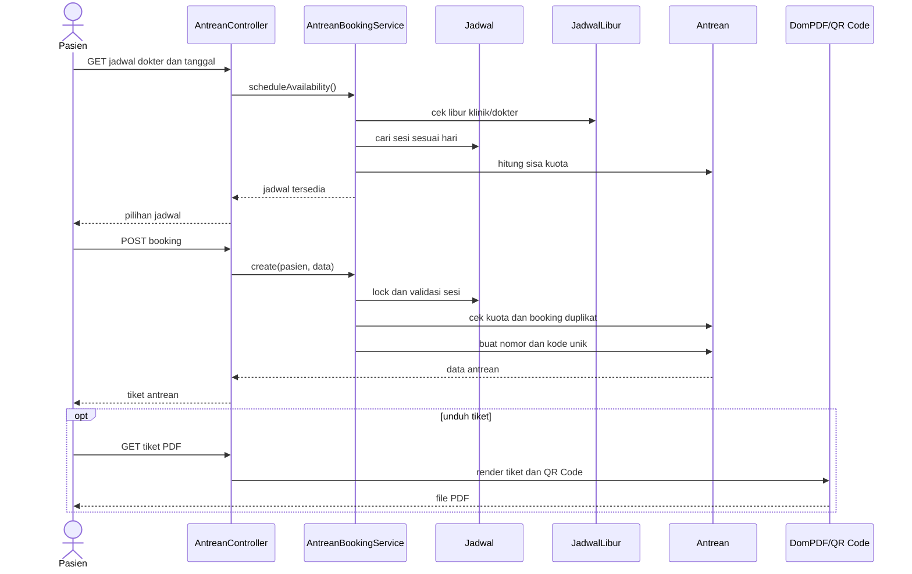
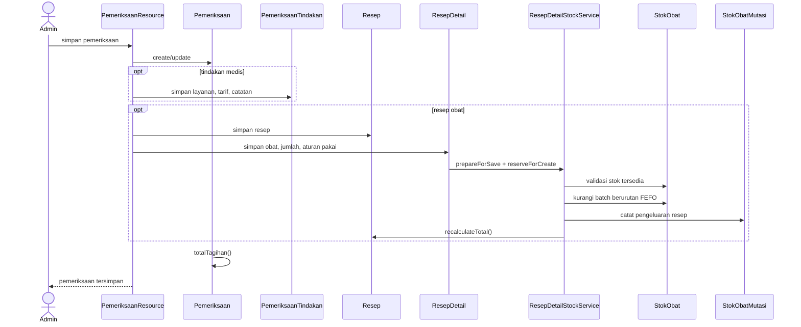
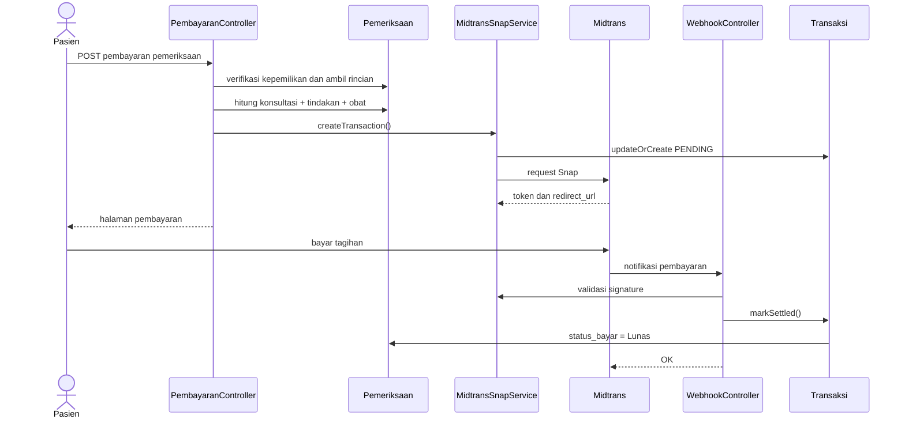
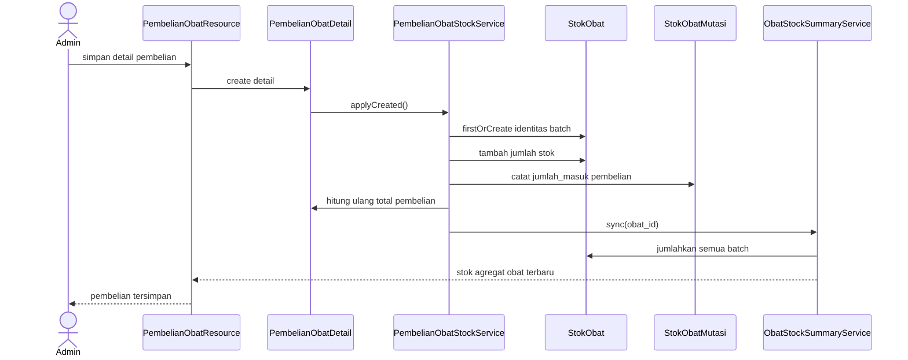
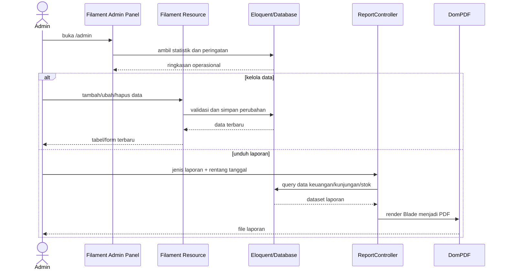

# Sequence Diagram - Sistem Informasi Klinik Ar-Ridlo

Diagram menampilkan komponen aplikasi yang benar-benar terlibat pada tujuh proses utama.

## 1. Autentikasi Pengguna

## 2. Pengajuan dan Aktivasi Pasien

## 3. Booking Antrean

## 4. Pemeriksaan, Tindakan, dan Resep

## 5. Pembayaran Pemeriksaan

## 6. Pembelian dan Stok Obat

## 7. Administrasi dan Laporan

