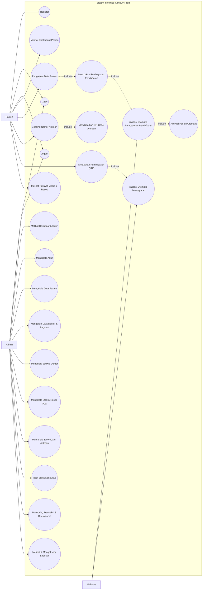

# Use Case Diagram - Sistem Informasi Klinik Ar-Ridlo

Dokumen ini mendeskripsikan use case utama Sistem Informasi Klinik Ar-Ridlo berdasarkan fitur aktual pada web.

## Ringkasan Aktor

| Aktor | Peran |
|---|---|
| Pasien | Mendaftar akun, mengajukan data pasien, melakukan pembayaran, booking antrean, melihat QR antrean, dan melihat riwayat medis serta resep. |
| Admin | Mengelola data operasional klinik, antrean, pemeriksaan, obat, resep, transaksi, dan laporan. |
| Midtrans | Menyediakan transaksi pembayaran dan mengirim validasi pembayaran otomatis melalui webhook. |

## Catatan Use Case

| Use case | Keterangan |
|---|---|
| Register | Pasien membuat akun pengguna untuk masuk ke sistem. |
| Pengajuan Data Pasien | Pasien melengkapi identitas pasien setelah memiliki akun. |
| Melakukan Pembayaran Pendaftaran | Pasien membayar biaya pendaftaran tetap Rp1.000 sebelum data pasien aktif. |
| Validasi Otomatis Pembayaran Pendaftaran | Sistem menerima webhook Midtrans dan memvalidasi pembayaran pendaftaran. |
| Aktivasi Pasien Otomatis | Setelah pembayaran pendaftaran sukses, sistem otomatis membuat/mengaktifkan data pasien. |
| Booking Nomor Antrean | Pasien memilih dokter, tanggal, dan jadwal kunjungan. |
| Mendapatkan QR Code Antrean | Sistem menghasilkan nomor antrean, kode antrean, dan QR Code tiket antrean. |
| Melakukan Pembayaran QRIS | Pasien membayar tagihan pemeriksaan melalui pembayaran QRIS. |
| Validasi Otomatis Pembayaran | Sistem menerima webhook Midtrans dan memperbarui status transaksi. |
| Melihat Riwayat Medis & Resep | Pasien melihat data pemeriksaan, diagnosa, tindakan, resep, dan tagihan terkait. |
| Mengelola Data Pasien | Admin membuat, melihat, mengubah, dan mengelola data pasien. |
| Mengelola Data Dokter & Pegawai | Admin mengelola data tenaga medis dan pegawai klinik. |
| Mengelola Jadwal Dokter | Admin mengatur jadwal praktik dokter. |
| Mengelola Stok & Resep Obat | Admin mengelola obat, stok, resep, dan detail resep. |
| Memantau & Mengatur Antrean | Admin melihat dan mengubah status antrean pasien. |
| Input Biaya Konsultasi | Admin memasukkan biaya konsultasi pada data pemeriksaan. |
| Monitoring Transaksi & Operasional | Admin memantau transaksi, pemasukan, pengeluaran, payroll, dan operasional klinik. |
| Melihat & Mengekspor Laporan | Admin melihat dan mengekspor laporan keuangan, kunjungan, dan stok obat. |
