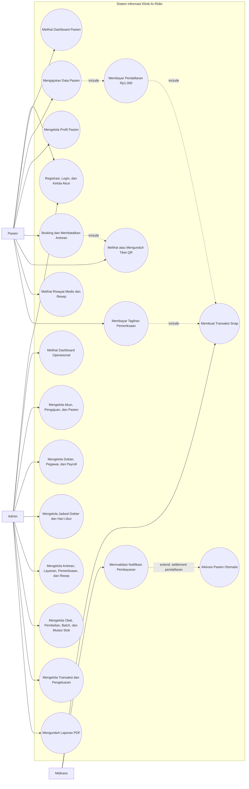

# Use Case Diagram - Sistem Informasi Klinik Ar-Ridlo

Diagram berikut disusun dari route pasien, resource Filament, service pembayaran, dan fitur laporan yang tersedia pada codebase.

## Ringkasan Aktor

| Aktor | Hak akses dan tanggung jawab |
|---|---|
| Pasien | Membuat akun, mengajukan data pasien, mengelola profil pasien miliknya, booking atau membatalkan antrean, mengakses tiket, melihat riwayat medis, dan membayar tagihan. |
| Admin | Mengelola seluruh data operasional melalui panel Filament, memantau dashboard, serta menghasilkan tiket, slip, dan laporan PDF. |
| Midtrans | Membuat transaksi Snap dan mengirim notifikasi status pembayaran ke webhook sistem. |

## Prasyarat dan Hasil Utama

| Use case | Prasyarat | Hasil |
|---|---|---|
| Registrasi | Pengunjung belum memiliki akun | Akun dengan role `pasien` dibuat dan dapat melakukan verifikasi email. |
| Pengajuan pasien | Pengguna login sebagai pasien dan belum memiliki pengajuan aktif | Pengajuan serta transaksi pendaftaran berstatus `PENDING` dibuat. |
| Aktivasi pasien | Signature webhook valid dan transaksi pendaftaran `SETTLEMENT`/`CAPTURE` | Data pasien dengan nomor rekam medis dibuat dan pengajuan menjadi `Disetujui`. |
| Booking antrean | Pasien aktif, dokter aktif, tanggal tidak lampau, jadwal cocok, bukan hari libur, kuota tersedia | Antrean `Menunggu` dengan nomor dan kode unik dibuat. |
| Pembatalan antrean | Antrean milik pasien masih `Menunggu` | Status antrean menjadi `Batal`. |
| Pembayaran pemeriksaan | Pemeriksaan milik pasien dan total tagihan minimal Rp1.000 | Transaksi Snap dibuat dari biaya konsultasi, tindakan, dan obat. |
| Validasi pembayaran | Signature Midtrans valid | Transaksi diperbarui; settlement membuat pemeriksaan `Lunas` atau mengaktifkan pasien. |
| Pengeluaran resep | Stok batch yang belum kedaluwarsa mencukupi | Stok dikurangi dengan FEFO dan mutasi resep tercatat. |
| Laporan | Admin login dan rentang tanggal valid | Laporan keuangan, kunjungan, atau stok obat diunduh sebagai PDF. |

## Aturan Akses

- `/login` digunakan oleh pasien dan admin; `/admin/login` hanya mengarahkan ke `/login`.
- Route `/pasien/*` dilindungi middleware `auth` dan `is.pasien`.
- Panel `/admin`, slip gaji, dan laporan dilindungi autentikasi serta pemeriksaan role admin.
- Pasien hanya dapat mengakses profil, antrean, pemeriksaan, dan transaksi yang terhubung ke akunnya.
